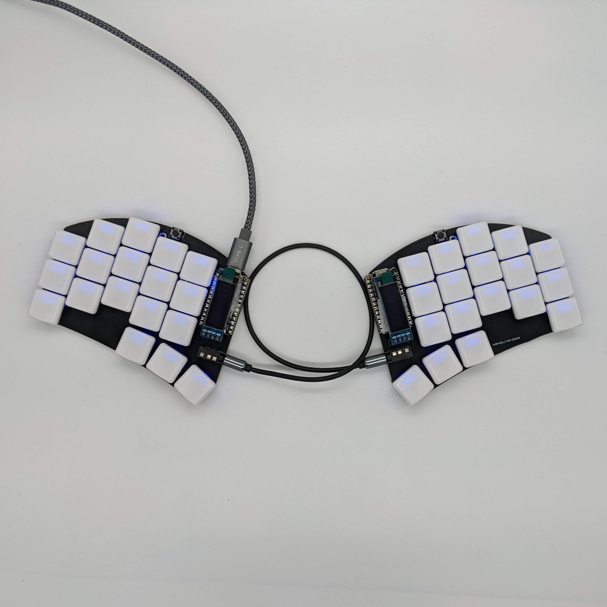
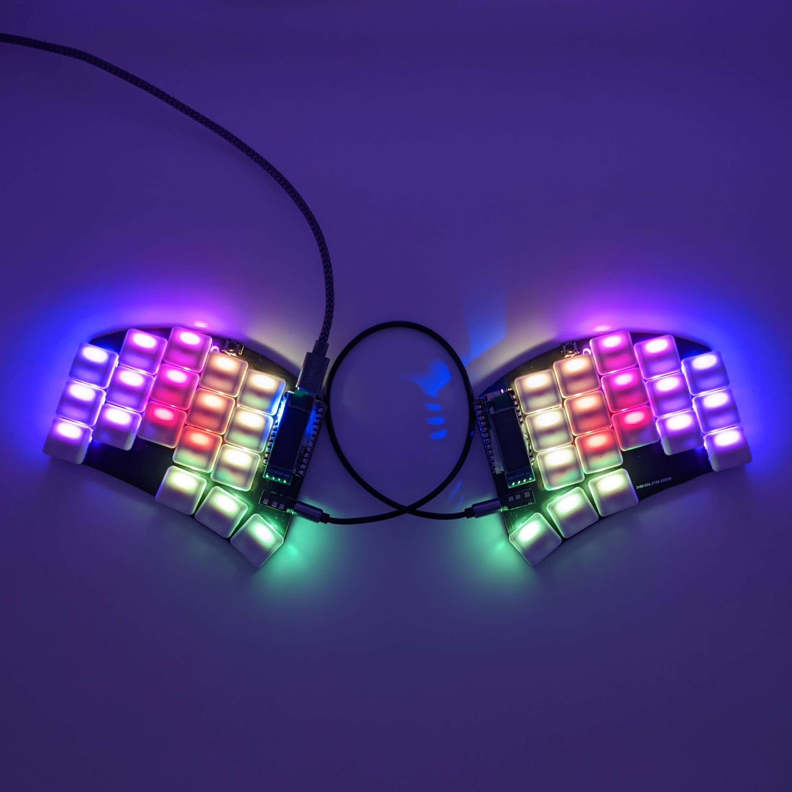
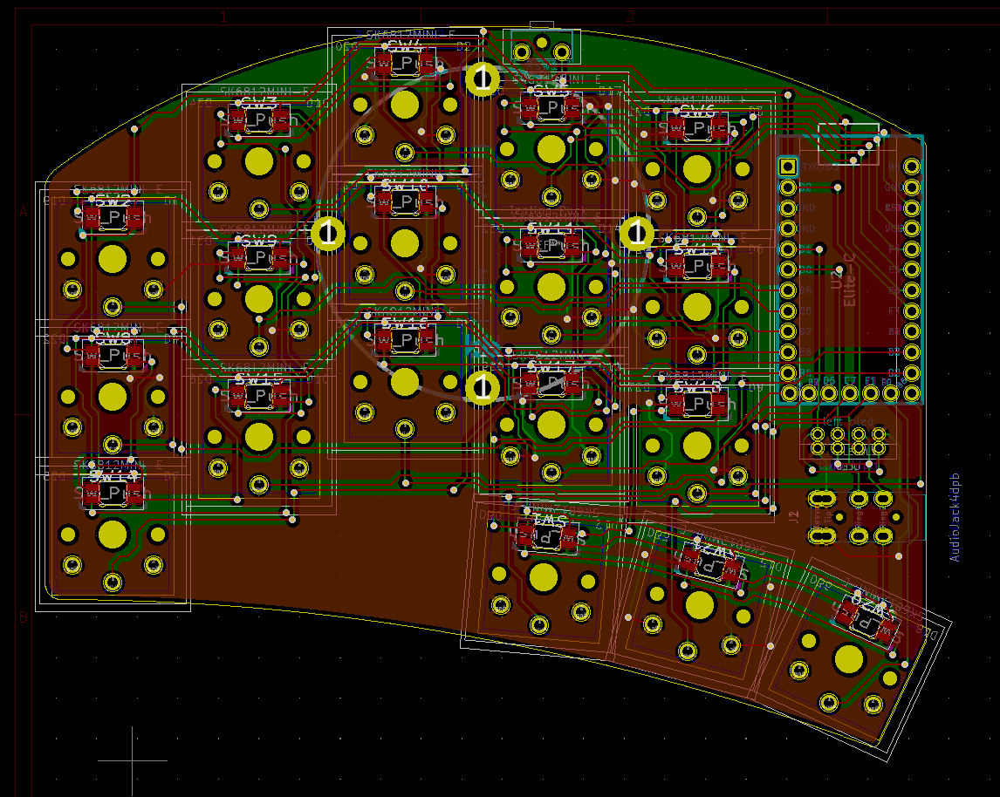
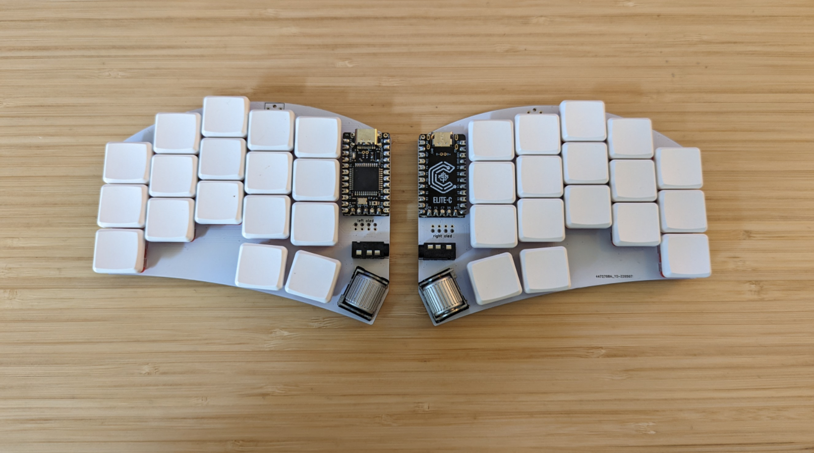

# Name

sweeeeep

why the name sweeeeep? because an elite-c is required to support the extra features, and an elite-c has 5 additional pins... so 5 Es for the 5 extra pins. Yes, it's dumb, I know.

# Descripiton

This is a reversible sweep pcb with support for 36 keys, per key leds, oled, and choc spacing. In order to continue to support a no diode setup, I added support for the elite-c, and this is now required for the build.

# Variations

There are currently 6 versions of this pcb, as found in the pcb directory:
* choc: No hotswap, 36 keys
* choc-rotated-inner-thumb: No hotswap, 36 keys, rotated inner thumb similar to the corne
* choc-hotswap: Hotswap only, 36 keys
* ks27-choc: Support for both choc and gateron ks-27 switches, no hotswap. Note that ks-27 switches use MX keycaps on a low profile switch. Given it's choc spacing, you will likely need to use custom smaller MX keycaps if using thees switches
* choc-evq-inside: Hotswap only, 34 key, with an evqwgd001 roller encoder on the inside thumb key
* choc-evq-outside: Hotswap only, 34 key, with an evqwgd001 roller encoder on the outside thumb key

# Support me!

I have spent a lot of time and money designing prototypes, testing, developing, etc. Any contributions would be greatly appreciated!

If you don't want to, or can't afford to support me, please send me a message to let me know you've built one, along with pictures. Also, feel free to submit a pull request with pictures into this repository. I'd be happy to showcase your build.

Reddit: /u/sadekbaroudi
Discord: sadekbaroudi#1258

# Firmware

## Vial

Special thanks to [Jason Hazel](https://github.com/jasonhazel) for adding vial support. Note that given vial with split code takes up most of the space, there is no support for the OLED or per key RGB. If you want those features, please use QMK below.

https://github.com/sadekbaroudi/vial-qmk/tree/vial/keyboards/fingerpunch/sweeeeep

## QMK

https://github.com/sadekbaroudi/qmk_firmware/tree/master/keyboards/fingerpunch/sweeeeep 

# Pictures

## sweeeeep choc

## sweeeeep evq inside

