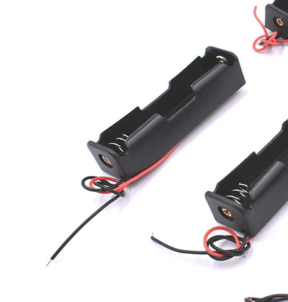
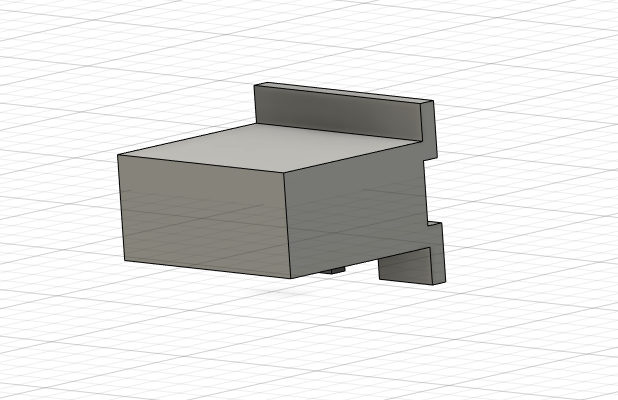
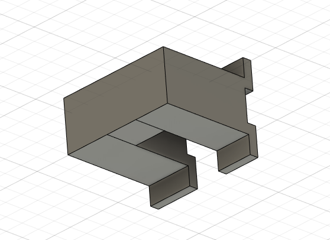
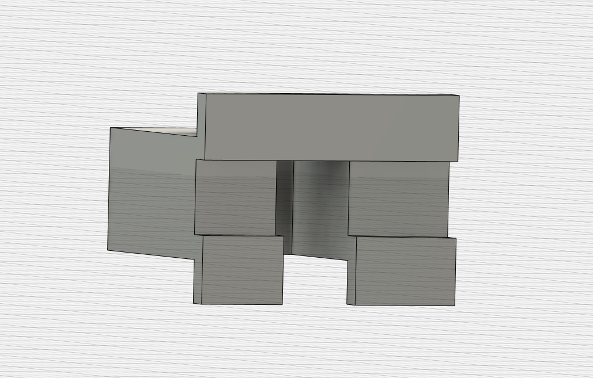
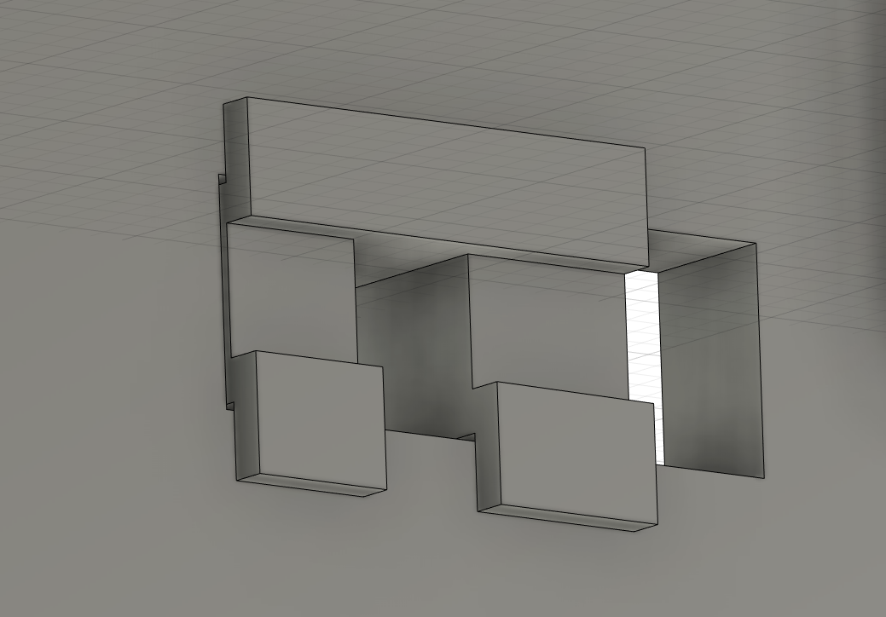
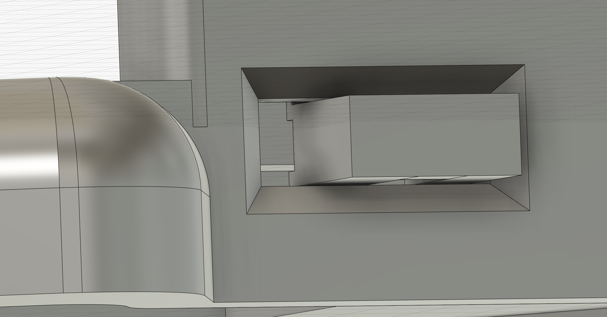

# swweeep case

## Required parts

* 2x body
* 2x bottom plate
* On-off switch extension (optional)
* 8-12x M2 heat-set inserts, 4mm in length
* 8-12x M2 screws, 4-6mm in length (5mm is best)

`swweeep-on-off-extension-small`, `swweeep-on-off-extension-medium`, and `swweeep-on-off-extension-large`

## Bodies

### swweeep-body-open-left

This is an uncovered case, which means the controller is exposed. Not recommended if using the nice!view, but fine otherwise

### swweeep-body-covered-left

Covered controller, to be used with a nice!view

### swweeep-body-covered-widecover-left

Covered controller, to be used with nice!view. This provides enough room on the side of the controller to store a 110 mAh battery. Note that this leaves the on/off switch a bit from the opening on the inside, so you'll need more precision with tweezers or a paper clip to turn it on and off.

However, given you can store the battery on top, you can use the thin bottom plate with this ( `swweeep-bot-widecover-left` )

## Bottom Plates

### swweeep-bot-left

This is a thin bottom plate, intended to be used with `swweeep-body-covered-left` or `swweeep-body-open-left`. Only use this plate if you have a 3mm thick battery and you are not using a JST connector. Otherwise, please use the `swweeep-bot-3mm-left` plate.

### swweeep-bot-3mm-left

This is a thin bottom plate, intended to be used with `swweeep-body-covered-left` or `swweeep-body-open-left`. As mentioned above, made to give a little extra room for a 4mm-4.5mm thick battery and/or a JST connector.

### swweeep-bot-widecover-left

This is a thin bottom plate, intended to be used with `swweeep-body-covered-widecover-left`. Given you are using this case to store the battery on the side of the controller, this is the recommended bottom plate.

### swweeep-bot-widecover-3mm-left

This is a thin bottom plate, intended to be used with `swweeep-body-covered-widecover-left`. I added this for good consistency, but it's unlikely you'd use this one. The only reason to use this bottom plate is that you are using the `swweeep-body-covered-widecover-left` body, not putting the battery next to the controller, and you have a 4mm thick battery or are using a JST connector.

### swweeep-bot-10deg-battery-small

This is a 10 degree tented bottom plate, intended to be used with `swweeep-body-covered-left` or `swweeep-body-open-left`. There is a small battery compartment in the tent to put your battery. Fits a 4mm thick 110 mah battery, up to 12mm x 33mm. Note that if you are using a JST connector, you should use the `swweeep-bot-10deg-battery-large` bottom plate. The positioning of the hole for this one is a bit off to the left, and the JST requires more space between the PCB and the plate.

### swweeep-bot-10deg-battery-large

This is a 10 degree tented bottom plate, intended to be used with `swweeep-body-covered-left` or `swweeep-body-open-left`. There is a large battery compartment in the tent to put your battery. Fits a battery up to 30mm x 52mm x 8mm

### swweeep-bot-18deg-18650

This is a 18 degree tented bottom plate, intended to be used with `swweeep-body-covered-left` or `swweeep-body-open-left`. Run the wires through the small holes in the bottom plate and solder to the PCB. Make sure the wires are long enough that you can safely take off the bottom plate without ripping the wires out of the through holes.

## On-Off Switch Extension

NOTE: This is only intended to be used with swweeep-v1.4 or prior, as I have changed the on/off switch. If you prefer the smaller switch with this switch extension, please feel free to fab v1.4. If you want the larger on/off switch, use v1.5. Please see the releases tab in the GitHub repo to select which you want to use.

This is a cover for the on-off switch. It should be placed into the hole for the on-off switch before putting the PCB into the case. There are three versions of this since different printers can generate slightly different results, especially at this scale. Please experiment with all of them until you find one that works.

(Special thanks to @kyek for the idea to do this)

