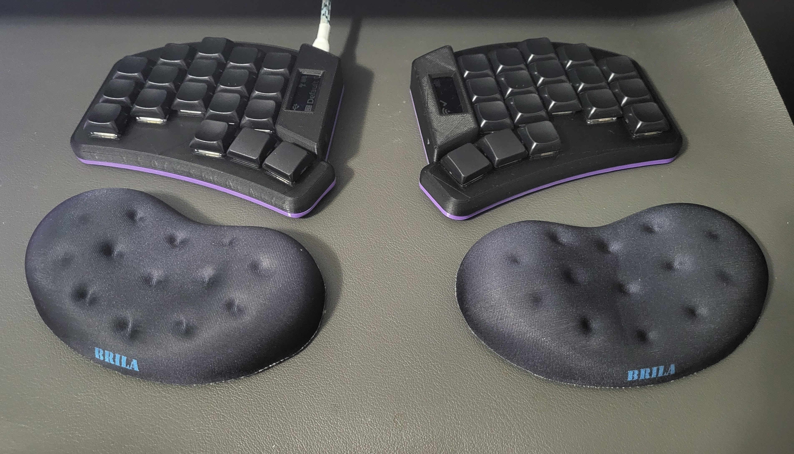

# swweeep case

## Required parts

* 2x body
* 2x bottom plate
* 8-12x M2 heat set inserts, 4mm in length
* 8-12x M2 screws, 4-6mm in length (5mm is best)

## Bodies

### swweeep-body-open-left

This is an uncovered case, which means the controller is exposed. Not recommended if using the nice!view, but fine otherwise

### swweeep-body-covered-left

Covered controller, to be used with a nice!view

### swweeep-body-covered-widecover-left

Covered controller, to be used with nice!view. This provides enough room on the side of the controller to store a 110 mah battery. Note that this leaves the on/off switch a bit from from the opening on the inside, so you'll need more precision with tweezers or a paper clip to turn it on and off.

However, given you can store the battery on top, you can use the thin bottom bottom plate with this ( `swweeep-bot-widecover-left` )

## Bottom Plates

### swweeep-bot-left

This is a thin bottom plate, intended to be used with `swweeep-body-covered-left` or `swweeep-body-open-left`. Only use this plate if you have a 3mm thick battery. If your battery is 4mm thick, please use the `swweeep-bot-3mm-left` plate.

### swweeep-bot-3mm-left

This is a thin bottom plate, intended to be used with `swweeep-body-covered-left` or `swweeep-body-open-left`. As mentioned above, made to give a little extra room for a 4mm-4.5mm thick battery.

### swweeep-bot-widecover-left

This is a thin bottom plate, intended to be used with `swweeep-body-covered-widecover-left`. Given you are using this case to store the battery on the side of the controller, this is the recommended bottom plate.

### swweeep-bot-widecover-3mm-left

This is a thin bottom plate, intended to be used with `swweeep-body-covered-widecover-left`. I added this for good consistency, but it's unlikely you'd use this one. The only reason to use this bottom plate is that you are using the `swweeep-body-covered-widecover-left` body, not putting the battery next to the controller, and you have a 4mm thick battery.

### swweeep-bot-10deg-battery-small

This is a 10 degree tented bottom plate, intended to be used with `swweeep-body-covered-left` or `swweeep-body-open-left`. There is a small battery compartment in the tent to put your battery. Fits a 4mm thick 110 mah battery, up to 12mm x 33mm

### swweeep-bot-10deg-battery-large

This is a 10 degree tented bottom plate, intended to be used with `swweeep-body-covered-left` or `swweeep-body-open-left`. There is a large battery compartment in the tent to put your battery. Fits a battery up to 30mm x 54mm x 10mm

